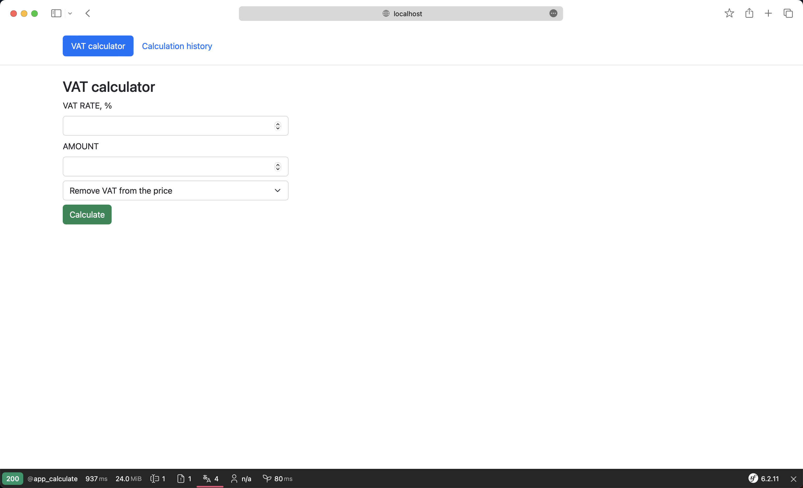

# Symfony VAT calculator

A VAT Calculator for adding or removing VAT from the price.

## Technical stack

- nginx 1.25.0
- PHP 8.2.6
- MariaDB 10.11.3
- Symfony 6.2.11

## Screenshots



## Getting Started

### Installing

This project requires:
* [Docker](https://docs.docker.com/)
* [Docker-compose](https://docs.docker.com/compose/)

#### Clone the project
```
$ git clone https://github.com/galkindev/symfony-vat-calculator.git
```

#### Running containers

```
$ docker-compose up
```

#### Starting application

```
$ open http://localhost:8000
```

### Running tests
```
$ docker-compose run --rm app ./bin/phpunit
```